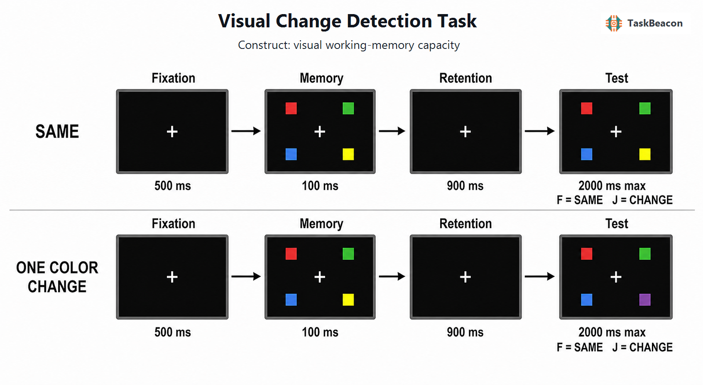

# 视觉变化检测范式：视觉工作记忆容量的操作化、神经指标与测量边界

视觉系统能够同时接收大量信息，但可在刺激消失后维持并用于当前判断的表征十分有限。视觉变化检测任务（visual change detection task）以短暂呈现的样本阵列、空白保持间隔和测验阵列构成最小实验单元，将视觉工作记忆（visual working memory, VWM）的编码、短时保持与比较决策置于可控时序中。其核心方法学价值在于：通过操纵记忆集合大小和测验是否发生变化，并联合分析命中与虚报，可以估计负荷增加时记忆表现的下降，而不把单纯的“报告变化”倾向误作记忆能力。该范式由此成为研究容量限制、特征绑定、个体差异及其神经相关的重要工具；与此同时，二元判断所包含的决策噪声、反应标准和模型假设也限定了“记住多少项目”这一解释的强度。

## 1. 范式提出与理论背景

序列阵列比较的前史来自对感觉存储与视觉短时记忆的区分。Phillips（1974）发现，插入空白间隔会使比较不再主要依赖高容量、易受掩蔽的视觉感觉痕迹，而转向容量受限但相对稳定的短时表征。Pashler（1988）进一步用整阵列变化检测考察熟悉性判断，指出测验阶段的总体熟悉性与项目级信息均可能影响“相同/变化”反应。这些工作奠定了样本—延迟—测验结构，也表明检测正确率从一开始就同时受存储和判断过程制约。

Luck 和 Vogel（1997）将短时颜色阵列与集合大小操纵结合，报告简单颜色或方向的表现约在四个项目附近出现明显容量限制；颜色与方向结合时未观察到按特征数成倍降低的容量，据此提出 VWM 的存储单位更接近整合对象。Vogel、Woodman 和 Luck（2001）通过改变特征、结合方式及测验形式细化了这一结论，并确立了约 100 ms 样本呈现与约 900 ms 保持间隔的常用程序。Cowan（2001）将多类短时记忆证据概括为约四个组块的容量限制，并提出可由命中率与虚报率校正反应偏向的容量估计。后续综述认为，颜色变化检测最稳定地揭示的是负荷相关的有限表现，而“固定槽位”与“连续资源”仍是对同一组行为规律的竞争性解释（Luck & Vogel, 2013）。因此，四项目上限应被视为特定刺激、测验与模型条件下的经验概括，而非跨任务不变的心理常数。

## 2. 任务逻辑、流程与核心参数

典型试次先呈现中央注视，随后短暂呈现若干空间位置不同的彩色项目；保持间隔中样本消失，测验阶段则呈现整阵列或单探测项目。相同试次保持颜色—位置对应不变，变化试次通常只替换一个位置的颜色，参与者作“相同”或“变化”二元判断。样本呈现足够短，可减少眼动逐项扫描和言语复述机会；延迟又将测验表现与瞬时感觉痕迹区分开来。集合大小是主要负荷操纵，同一集合大小内平衡相同与变化试次，可避免变化概率与反应标准系统性混杂（Luck & Vogel, 1997; Vogel et al., 2001）。

变化试次答“变化”构成命中，答“相同”构成漏报；相同试次答“变化”构成虚报，答“相同”构成正确拒绝。除正确率和反应时外，常用指标为 \(K=N(H-FA)\)，其中 \(N\) 为集合大小、\(H\) 为命中率、\(FA\) 为虚报率（Cowan, 2001）。该式在假设各项目具有等概率进入有限容量存储、未存储项目靠猜测作答时，把二元表现换算为“项目数”。若研究目标是知觉敏感性或决策标准，则应同时报告信号检测指标 \(d'\) 与 criterion；若使用整阵列而非单探测测验，改变可发生于多个潜在位置，模型中的猜测和比较机会也随之变化。反馈不是范式定义所必需，许多容量测量仅在练习阶段提供规则确认，以免正式试次中的反馈学习改变判断标准。

不同任务阶段支持的构念推断并不相同。样本期集合大小效应包含视觉编码、空间选择与知觉拥挤；保持期的负荷差异更接近已编码表征的维持，但仍受注意波动和编码成功率影响；测验期的“变化—相同”对比还包含比较、熟悉性、决策与按键执行。因而，集合大小较大时正确率下降不能单独证明表征以固定槽位离散丢失，反应时延长也不能单独定位为保持过程变慢。将阶段、对比和指标对应起来，是变化检测结果获得构念效度的前提。

## 3. 主要行为与神经科学发现

### 3.1 容量、干扰与决策过程

颜色阵列研究通常观察到：低负荷时正确率较高，负荷超过约三至四项后下降，按 \(K\) 换算的容量趋于平台；这一规律支持 VWM 有限，但不唯一支持固定项目槽位。Lin 和 Oberauer（2022）在单探测变化检测中设置与非目标项目匹配的探测刺激，发现这种探测比全新刺激更难拒绝，说明集合大小效应部分来自项目间干扰；其干扰模型和神经群体模型较能同时解释负荷效应与非目标侵入。该结果把“未存入”之外的表征混淆纳入解释范围。

二元变化判断还具有明确的信号检测性质。Williams 等（2022）基于置信判断与多项实验指出，记忆证据可呈连续强度分布，\(K\) 会把反应偏向与记忆强度混合，因而不能在不检验模型假设时直接当作被记住项目的计数。Yonelinas（2024）提出阈限式回想与连续熟悉性可以共同参与视觉工作记忆判断，进一步说明离散容量和连续信号并非必须二选一。研究设计若只报告总体正确率或最大 \(K\)，会遗漏命中—虚报的不对称以及标准漂移；同时报告分集合大小的 \(H\)、\(FA\)、\(K\) 和 \(d'\)，更有利于区分存储限制、干扰与判断策略。

### 3.2 EEG 与 fMRI 证据

侧化颜色阵列任务形成了保持期的对侧延迟活动（contralateral delay activity, CDA）：记忆阵列一侧项目所对应的后部头皮持续负向电位随负荷增加，在接近个体行为容量时趋于饱和；CDA 负荷效应还与个体 \(K\) 差异相关（Vogel & Machizawa, 2004）。综合研究认为，CDA 对保持项目数、过滤无关项目和表征状态均敏感，因此适合追踪编码后数百毫秒内的负荷变化，但不是一个不受注意选择与任务设置影响的纯容量计数器（Luria et al., 2016）。Roy 和 Faubert（2023）使用公开 EEG 数据以统一流程复现八项 CDA 研究，发现多数关键负荷效应可重现，同时不同数据集的效应强度和个体相关并不完全一致。这一结果支持 CDA 作为群体水平保持期指标，也要求个体差异研究预先规定侧化条件、时间窗和清理流程；头皮电位本身不提供精确脑源定位。

功能磁共振成像（fMRI）从空间分布补充了上述时间证据。Todd 和 Marois（2004）在变化检测负荷增加时观察到后顶叶活动随可保持信息量上升并在行为容量附近饱和。Xu 和 Chun（2006）比较简单与复杂形状发现，下顶内沟活动主要随对象数变化，而上顶内沟和外侧枕叶活动还受对象复杂度影响，提示“对象数量限制”与“表征细节需求”具有可区分的神经相关。上述 BOLD 差异说明顶枕网络参与编码和保持，其负荷函数与行为表现相关；由于集合大小同时改变知觉输入、注意分配与任务难度，现有对比不能单独证明某一区域因果决定容量，也不能把区域活动等同于主观记忆内容。

## 4. 范式发展与主要应用

变化检测的应用已从成年人的容量估计扩展到发展和临床研究。McKay 等（2021）在学龄前儿童家庭环境中结合便携式功能近红外光谱与颜色变化检测，显示该范式可在非实验室场景中联结行为负荷效应与额顶叶血氧反应；儿童年龄、任务理解、运动伪迹和家庭设备差异仍需与容量解释分开。精神分裂症研究使用颜色或颜色—方向阵列发现患者在低、较高负荷均可能受损，而特征绑定并非必然选择性异常；低负荷错误提示任务规则维持或注意控制也可贡献组间差异（Gold et al., 2003）。因此，变化检测适合检验群体层面的表征维持与选择控制假设，却不能凭单次 \(K\) 值完成个体诊断。

方法学发展也改变了容量测量方式。变化定位任务令每个试次必有一个项目改变，并要求指出改变位置，从多项选择反应中提取容量；该变式在较少试次下可获得高于传统相同/变化判断的信度与敏感性，但其猜测结构、反应要求和构念权重并不等同于经典变化检测（Zhao et al., 2023）。这些进展说明，范式选择应服从研究问题：若关注传统命中—虚报结构与决策标准，保留二元变化检测更合适；若主要目标是稳定排序个体容量，定位式测验可能提高试次效率。

## 5. 测量效度与解释边界

颜色变化检测能够产生稳定的群体集合大小效应，但个体水平信度取决于试次数、样本异质性、集合大小范围及容量模型。Xu 等（2018）在大量单探测试次中报告较高内部一致性，并发现跨 31 次测量的个体排序总体稳定；降采样同时表明，缩短任务会明显降低信度。若模型需要至少一个低于容量的集合大小来估计注意遗漏，却只采集高负荷条件，参数可能失真。TaskBeacon 所用集合大小 2 可提供低负荷锚点，但其整阵列测验和每个条件的试次数与该信度研究不同，不能直接移用后者的信度数值。

构念效度的主要限制来自三类混合。第一，颜色可辨性、位置间距和拥挤影响编码，改变色若与原色知觉距离不同也会改变检测难度。第二，保持间隔内的注意波动、项目间干扰和长时经验可改变表征质量。第三，测验显示形式、变化概率、速度要求与按键偏好共同塑造反应标准。\(K\) 在同一刺激体系和固定程序内适合描述负荷函数，但跨实验比较前需统一测验形式、集合大小与计分模型。近期信号检测和混合过程研究尤其表明，稳定的 \(K\) 不等同于固定数量的离散表征（Williams et al., 2022; Yonelinas, 2024）。预注册主要指标、报告完整命中—虚报数据、进行色觉筛查并控制显示设备，是提高可解释性的基本条件。

## 6. TaskBeacon 中的任务实现

### 6.1 任务资源与访问入口

| 资源 | ID | 用途 | 地址 |
|---|---|---|---|
| 完整本地实验实现 | T000068 | PsychoPy 行为采集与事件标记 | [GitHub 仓库](https://github.com/TaskBeacon/T000068-visual-change-detection-task) |
| 浏览器预览源码 | H000068 | 浏览器行为版源码 | [GitHub 仓库](https://github.com/TaskBeacon/H000068-visual-change-detection-task) |
| 在线运行入口 | H000068 | 直接体验浏览器行为版 | [PsyFlow Web](https://taskbeacon.github.io/psyflow-web/?task=H000068-visual-change-detection-task) |

T000068 是英文行为任务，当前元数据标记为 draft。H000068 保留相同的八个练习试次和 160 个正式试次，以及集合大小、时序、按键与计分规则；浏览器事件取代本地串行事件标记，故该预览适合程序体验和行为数据采集，不应视为具有专用采集硬件时序控制的等价替代。

### 6.2 实现流程与关键参数

**图1. TaskBeacon 视觉变化检测任务的单试次流程与条件映射。** 每个试次依次包含中央注视 500 ms、记忆阵列 100 ms、保持期注视 900 ms及最长 2000 ms 的测验/反应窗。记忆阵列从八个固定位置中随机选取 2、4、6 或 8 个位置，每个位置呈现一个边长 1.25°且试次内不重复的颜色方块；相同条件的测验阵列保持颜色与位置不变，变化条件仅把一个位置的颜色替换为样本阵列未使用的颜色。F 键报告“相同”，J 键报告“变化”，有效反应立即结束测验显示；超时记为无反应，正式试次不提供反馈。每个集合大小下的命中率与虚报率用于计算 \(K=N(H-FA)\)。任务不采用自适应控制：种子化计划在运行前平衡 4（集合大小）×2（测验状态）条件，并预定位置、颜色、改变项目及试次顺序。

| 参数 | 当前设置 | 分析含义 |
|---|---:|---|
| 练习与正式试次 | 8；160 | 正式阶段每个“集合大小×测验状态”单元 20 次 |
| 集合大小 | 2、4、6、8 | 描述负荷函数并以低负荷条件约束解释 |
| 相同/变化比例 | 各 50% | 各集合大小内平衡反应类别 |
| 主要记录 | 正确性、反应时、命中、漏报、虚报、正确拒绝 | 支持准确率、反应时和分集合大小的 \(K\) 分析 |

该实现的整阵列测验与经典颜色阵列程序一致，变化位置固定、只替换一种颜色，从而减少位置改变和新旧颜色重复造成的歧义。最大 \(K\) 作为结束摘要呈现，但研究分析宜保留四个集合大小的完整负荷函数，并结合命中率与虚报率判断最大值是否受反应偏向或抽样波动影响。

## 参考文献

Cowan, N. (2001). The magical number 4 in short-term memory: A reconsideration of mental storage capacity. *Behavioral and Brain Sciences, 24*(1), 87–114. https://doi.org/10.1017/S0140525X01003922

Gold, J. M., Wilk, C. M., McMahon, R. P., Buchanan, R. W., & Luck, S. J. (2003). Working memory for visual features and conjunctions in schizophrenia. *Journal of Abnormal Psychology, 112*(1), 61–71. https://doi.org/10.1037/0021-843X.112.1.61

Lin, H.-Y., & Oberauer, K. (2022). An interference model for visual working memory: Applications to the change detection task. *Cognitive Psychology, 133*, 101463. https://doi.org/10.1016/j.cogpsych.2022.101463

Luck, S. J., & Vogel, E. K. (1997). The capacity of visual working memory for features and conjunctions. *Nature, 390*(6657), 279–281. https://doi.org/10.1038/36846

Luck, S. J., & Vogel, E. K. (2013). Visual working memory capacity: From psychophysics and neurobiology to individual differences. *Trends in Cognitive Sciences, 17*(8), 391–400. https://doi.org/10.1016/j.tics.2013.06.006

Luria, R., Balaban, H., Awh, E., & Vogel, E. K. (2016). The contralateral delay activity as a neural measure of visual working memory. *Neuroscience & Biobehavioral Reviews, 62*, 100–108. https://doi.org/10.1016/j.neubiorev.2016.01.003

McKay, C. A., Shing, Y. L., Rafetseder, E., & Wijeakumar, S. (2021). Home assessment of visual working memory in pre-schoolers reveals associations between behaviour, brain activation and parent reports of life stress. *Developmental Science, 24*(4), e13094. https://doi.org/10.1111/desc.13094

Pashler, H. (1988). Familiarity and visual change detection. *Perception & Psychophysics, 44*(4), 369–378. https://doi.org/10.3758/BF03210419

Phillips, W. A. (1974). On the distinction between sensory storage and short-term visual memory. *Perception & Psychophysics, 16*(2), 283–290. https://doi.org/10.3758/BF03203943

Roy, Y., & Faubert, J. (2023). Is the contralateral delay activity (CDA) a robust neural correlate for visual working memory (VWM) tasks? A reproducibility study. *Psychophysiology, 60*(2), e14180. https://doi.org/10.1111/psyp.14180

Todd, J. J., & Marois, R. (2004). Capacity limit of visual short-term memory in human posterior parietal cortex. *Nature, 428*(6984), 751–754. https://doi.org/10.1038/nature02466

Vogel, E. K., & Machizawa, M. G. (2004). Neural activity predicts individual differences in visual working memory capacity. *Nature, 428*(6984), 748–751. https://doi.org/10.1038/nature02447

Vogel, E. K., Woodman, G. F., & Luck, S. J. (2001). Storage of features, conjunctions, and objects in visual working memory. *Journal of Experimental Psychology: Human Perception and Performance, 27*(1), 92–114. https://doi.org/10.1037/0096-1523.27.1.92

Williams, J. R., Robinson, M. M., Schurgin, M. W., Wixted, J. T., & Brady, T. F. (2022). You cannot “count” how many items people remember in visual working memory: The importance of signal detection–based measures for understanding change detection performance. *Journal of Experimental Psychology: Human Perception and Performance, 48*(12), 1390–1409. https://doi.org/10.1037/xhp0001055

Xu, Y., & Chun, M. M. (2006). Dissociable neural mechanisms supporting visual short-term memory for objects. *Nature, 440*(7080), 91–95. https://doi.org/10.1038/nature04262

Xu, Z., Adam, K. C. S., Fang, X., & Vogel, E. K. (2018). The reliability and stability of visual working memory capacity. *Behavior Research Methods, 50*(2), 576–588. https://doi.org/10.3758/s13428-017-0886-6

Yonelinas, A. P. (2024). The role of recollection and familiarity in visual working memory: A mixture of threshold and signal detection processes. *Psychological Review, 131*(2), 321–348. https://doi.org/10.1037/rev0000432

Zhao, C., Vogel, E., & Awh, E. (2023). Change localization: A highly reliable and sensitive measure of capacity in visual working memory. *Attention, Perception, & Psychophysics, 85*(5), 1681–1694. https://doi.org/10.3758/s13414-022-02586-0
